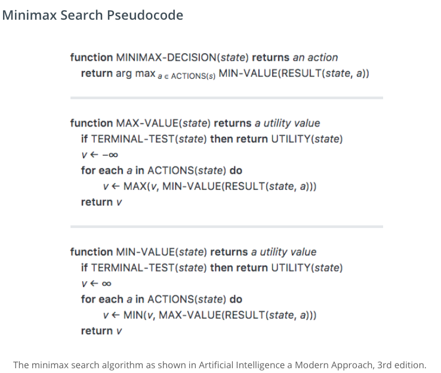
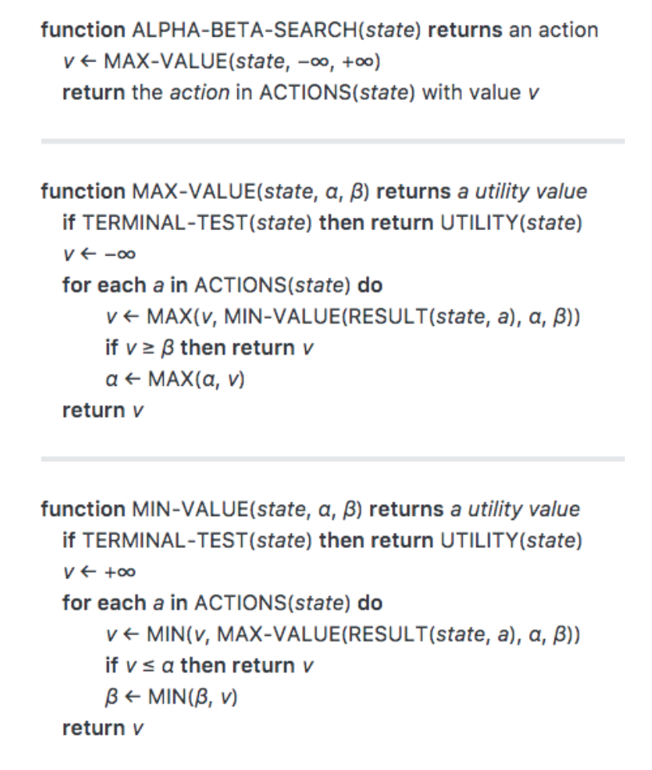

## Introduction
Simple implementation of Minimax and Alpha-Beta Search algorithms in python.

## Algorithms

### Minimax Search

    

### Alpha-Beta Search

    

## References
- [Alpha-Beta Pruning Practice](http://inst.eecs.berkeley.edu/~cs61b/fa14/ta-materials/apps/ab_tree_practice/)
- [一看就懂的Alpha-Beta剪枝算法详解](http://blog.csdn.net/baixiaozhe/article/details/51872495)